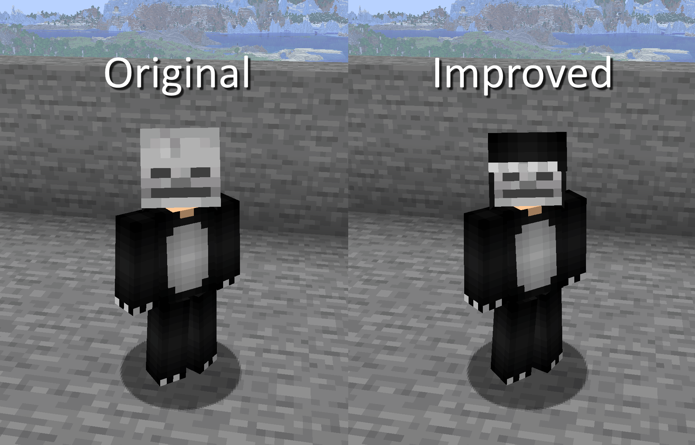

## Minecraft Vanity Armor Datapack

<em>Created by FancyPotatOS</em>

Adds the ability to turn your armorsets into whatever armor pieces you want

### Resource Pack

There is included two resource packs. Unfortunately, you must use one or the other if you want vanity items with heads or skulls to look correct.

- Resource Pack (Original)

Skulls look completely normal, this is just a fix for vanity armor that uses skulls and heads.

- Resource Pack (Improved)

Provides special models for vanity skulls and heads, so that the skull fits _juuuuust_ above the player's inner skin layer. This allows you to wear them as if it's a part of your own skin!

### How To Use

Rename the target vanity armor piece to **_vanity_** in the anvil.
Throw the vanity piece and the target armor piece into a water cauldron.

When you hear bubbling, then the armor piece has been successfully overwritten

Note that if you want trims to appear, you'll actually need to put it on the original armor piece, not the vanity one!

### Failsafe

There is no feature to undo a vanity change, however there is a function you can run in case you wish to split the pieces.

Run the command `/execute as @n[type=item] run function vanityarmor:split` to split apart the nearest item to you.

